Exploring ggplot
================

``` r
library(ggplot2)
library(tidyverse)
```

    ## -- Attaching packages ------------------------------------------------------------ tidyverse 1.2.1 --

    ## v tibble  1.4.2     v purrr   0.2.4
    ## v tidyr   0.8.0     v dplyr   0.7.5
    ## v readr   1.1.1     v stringr 1.3.0
    ## v tibble  1.4.2     v forcats 0.3.0

    ## -- Conflicts --------------------------------------------------------------- tidyverse_conflicts() --
    ## x dplyr::filter() masks stats::filter()
    ## x dplyr::lag()    masks stats::lag()

``` r
head(mpg)
```

    ## # A tibble: 6 x 11
    ##   manufacturer model displ  year   cyl trans drv     cty   hwy fl    class
    ##   <chr>        <chr> <dbl> <int> <int> <chr> <chr> <int> <int> <chr> <chr>
    ## 1 audi         a4      1.8  1999     4 auto~ f        18    29 p     comp~
    ## 2 audi         a4      1.8  1999     4 manu~ f        21    29 p     comp~
    ## 3 audi         a4      2    2008     4 manu~ f        20    31 p     comp~
    ## 4 audi         a4      2    2008     4 auto~ f        21    30 p     comp~
    ## 5 audi         a4      2.8  1999     6 auto~ f        16    26 p     comp~
    ## 6 audi         a4      2.8  1999     6 manu~ f        18    26 p     comp~

``` r
#displacement vs highway
ggplot(data = mpg)+
  geom_point(mapping = aes(x=displ,y=hwy))
```


``` r
ggplot(data = mpg)+
  geom_point(mapping = aes(x=hwy,y=cyl))
```


``` r
ggplot(data = mpg)+
  geom_point(mapping = aes(x=class,y=drv))
```


``` r
#displacement vs highway with color as class
ggplot(data = mpg)+
  geom_point(mapping = aes(x=displ,y=hwy, color = class))
```


``` r
#displacement vs highway with size as class
ggplot(data = mpg)+
  geom_point(mapping = aes(x=displ,y=hwy, size = class))
```

    ## Warning: Using size for a discrete variable is not advised.

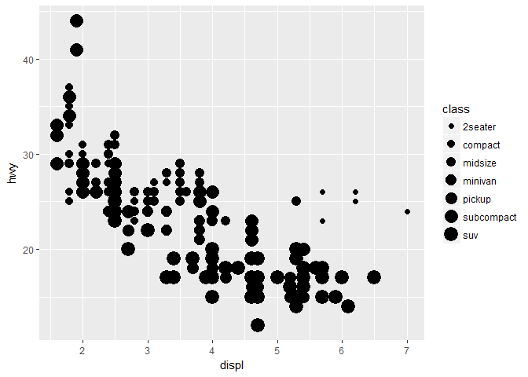

``` r
#displacement vs highway with color gradient as class
ggplot(data = mpg)+
  geom_point(mapping = aes(x=displ,y=hwy, alpha = class))
```

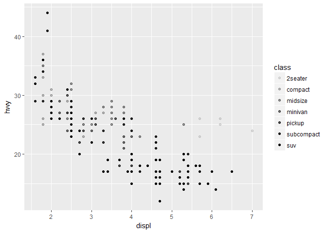

``` r
#displacement vs highway with shape as class
ggplot(data = mpg)+
  geom_point(mapping = aes(x=displ,y=hwy, shape = class))
```

    ## Warning: The shape palette can deal with a maximum of 6 discrete values
    ## because more than 6 becomes difficult to discriminate; you have 7.
    ## Consider specifying shapes manually if you must have them.

    ## Warning: Removed 62 rows containing missing values (geom_point).

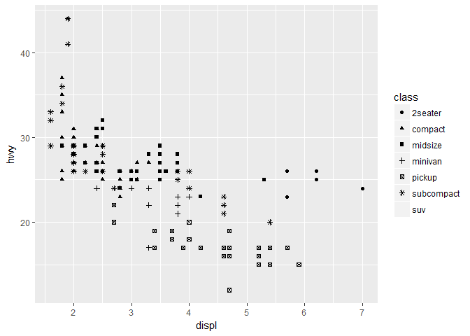

``` r
ggplot(data = mpg)+
  geom_point(mapping = aes(x=displ,y=hwy) , color = "red")
```


``` r
#shapes range from 0 - 20
ggplot(data = mpg)+
  geom_point(mapping = aes(x=displ,y=hwy) , shape = 4)
```

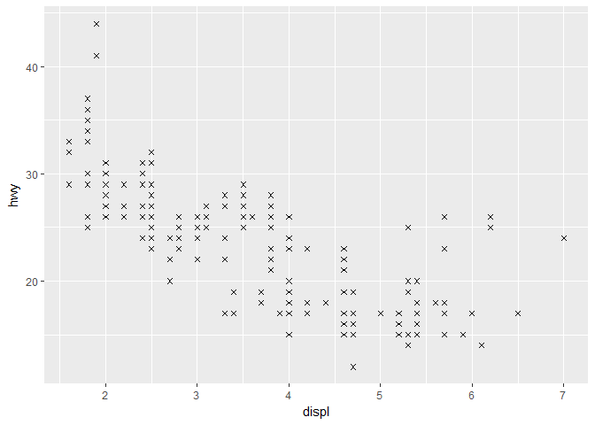

``` r
#displacement vs highway with color as class
ggplot(data = mpg)+
  geom_point(mapping = aes(x=displ,y=hwy, color = cty))
```

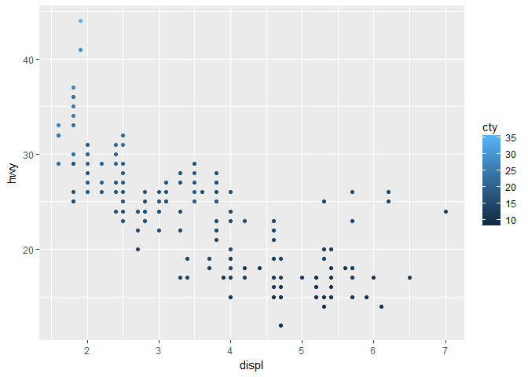

``` r
#displacement vs highway with size as class
ggplot(data = mpg)+
  geom_point(mapping = aes(x=displ,y=hwy, size = cty))
```

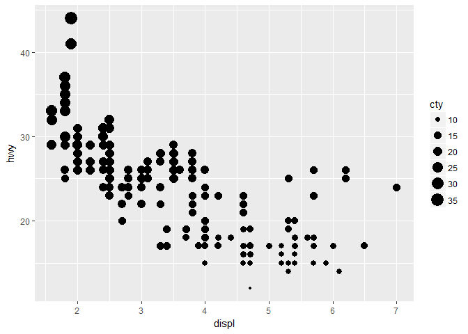

``` r
#displacement vs highway with color gradient as class
ggplot(data = mpg)+
  geom_point(mapping = aes(x=displ,y=hwy, alpha = cty))
```

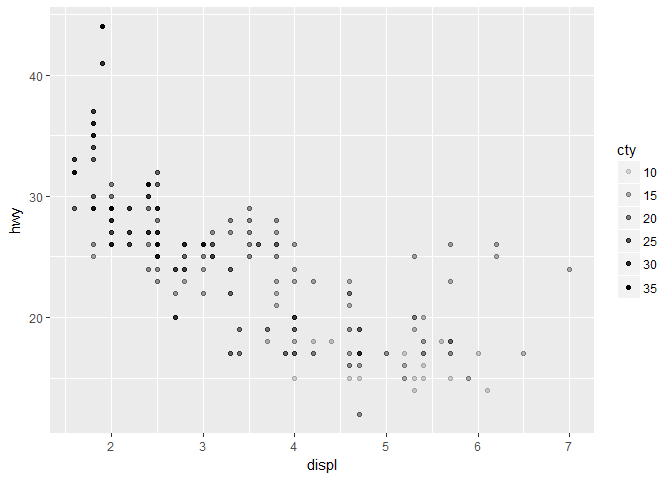

``` r
#multiple aesthetics
ggplot(data = mpg)+
  geom_point(mapping = aes(x=displ,y=hwy, size = cty, color = class,shape=drv))
```

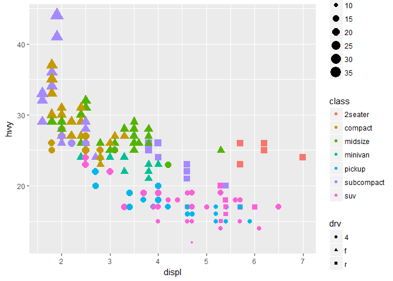

``` r
ggplot(data = mpg)+
  geom_point(mapping = aes(x=displ,y=hwy) , shape = 13, stroke = 0.1)
```

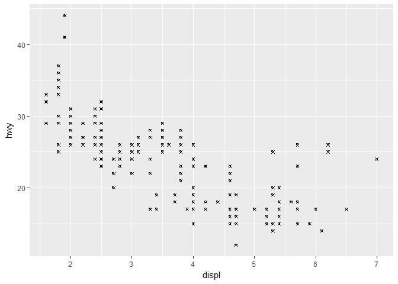

``` r
ggplot(data = mpg)+
  geom_point(mapping = aes(x=displ,y=hwy,color=displ<5))
```

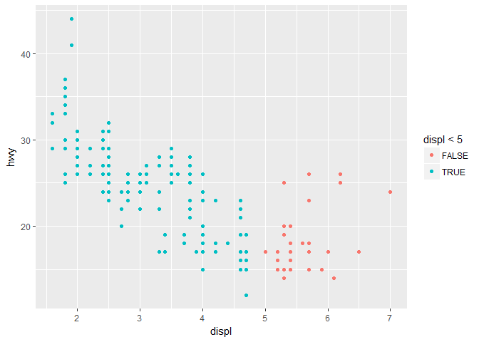

``` r
#adding facets
ggplot(data = mpg)+
  geom_point(mapping = aes(x=displ,y=hwy) , shape = 1)+
  facet_wrap(~class , nrow=2)
```

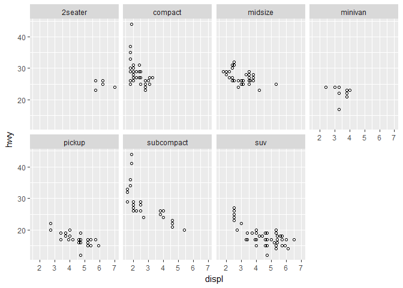

``` r
ggplot(data = mpg)+
  geom_point(mapping = aes(x=displ,y=hwy) , shape = 1)+
  facet_grid(drv~cyl)
```

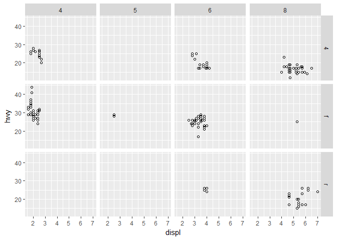

``` r
ggplot(data = mpg)+
  geom_point(mapping = aes(x=displ,y=hwy) , shape = 1)+
  facet_grid(.~cyl)
```

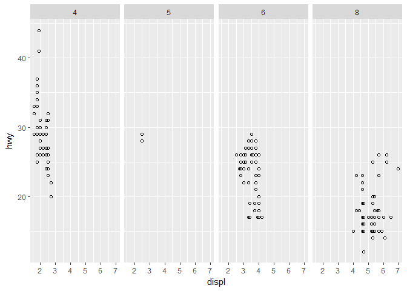

``` r
ggplot(data = mpg)+
  #geom_point(mapping = aes(x = displ,y = hwy))
  geom_smooth(mapping = aes(x = displ,y = hwy))
```

    ## `geom_smooth()` using method = 'loess'


``` r
ggplot(data = mpg)+
  #geom_point(mapping = aes(x = displ,y = hwy))
  geom_smooth(mapping = aes(x = displ,y = hwy, linetype = drv))
```

    ## `geom_smooth()` using method = 'loess'

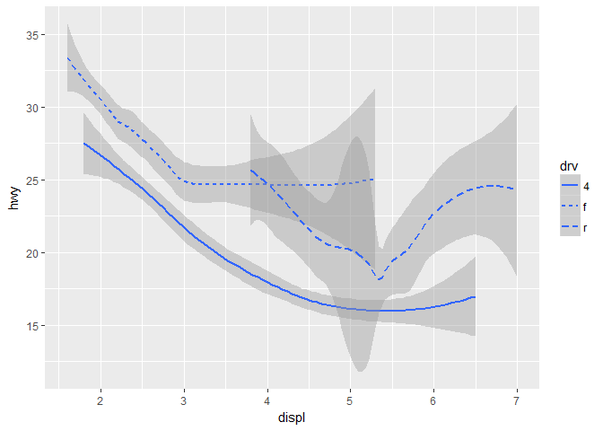

``` r
ggplot(data = mpg)+
  geom_point(mapping = aes(x = displ,y = hwy,color=drv))+
  geom_smooth(mapping = aes(x = displ,y = hwy, linetype = drv))
```

    ## `geom_smooth()` using method = 'loess'

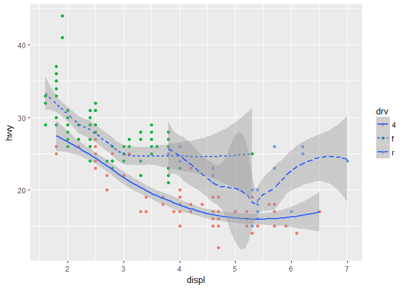

``` r
ggplot(data = mpg)+
  geom_smooth(mapping = aes(x = displ,y = hwy))
```

    ## `geom_smooth()` using method = 'loess'

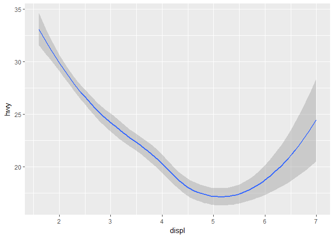

``` r
ggplot(data = mpg)+
  geom_smooth(mapping = aes(x = displ,y = hwy, linetype = drv, group = drv))
```

    ## `geom_smooth()` using method = 'loess'


``` r
ggplot(data = mpg)+
  geom_smooth(mapping = aes(x = displ,y = hwy, color=drv))
```

    ## `geom_smooth()` using method = 'loess'

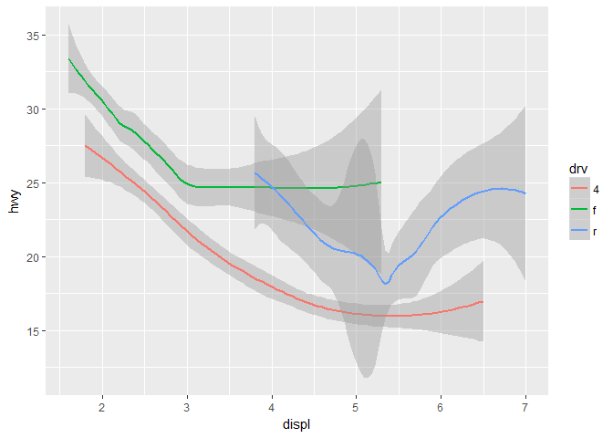

``` r
ggplot(data = mpg)+
  geom_point(mapping = aes(x=displ, y=hwy))+
  geom_smooth(mapping = aes(x=displ, y = hwy))
```

    ## `geom_smooth()` using method = 'loess'


``` r
ggplot(data=mpg,mapping = aes(x=displ,y=hwy))+
  geom_point()+
  geom_smooth()
```

    ## `geom_smooth()` using method = 'loess'


``` r
ggplot(data=mpg,mapping = aes(x=displ,y=hwy))+
  geom_point(mapping = aes(color=class))+
  geom_smooth()
```

    ## `geom_smooth()` using method = 'loess'

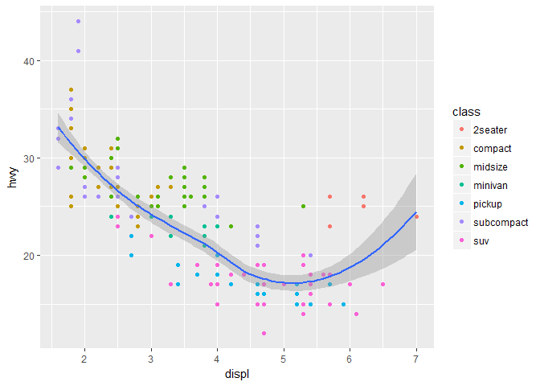

``` r
ggplot(data=mpg,mapping = aes(x=displ,y=hwy))+
  geom_point(mapping = aes(color = class))+
  geom_smooth(data = filter(mpg, class == "subcompact"),se=FALSE) # SE - standard error
```

    ## `geom_smooth()` using method = 'loess'

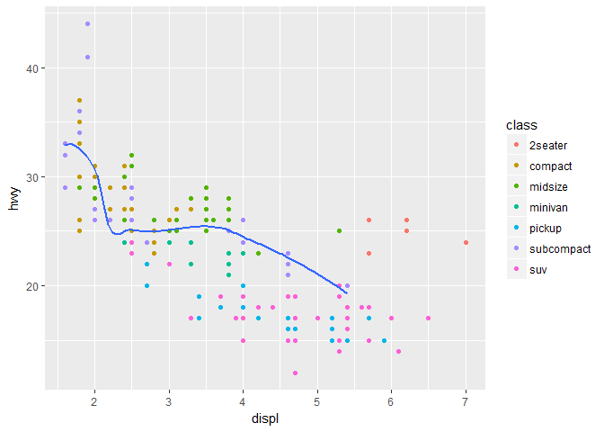

``` r
ggplot(data = mpg, mapping = aes(x = displ, y = hwy, color = drv)) + 
  geom_point(show.legend = FALSE) + 
  geom_smooth(se = FALSE,show.legend = FALSE)
```

    ## `geom_smooth()` using method = 'loess'

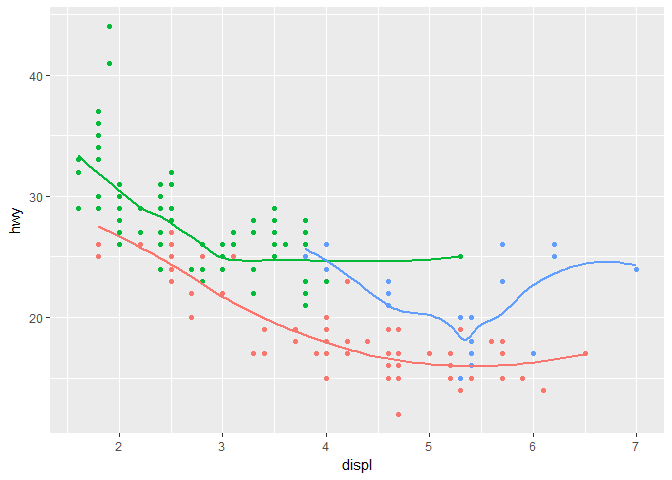

``` r
ggplot(data = mpg) +
  geom_smooth(
    mapping = aes(x = displ, y = hwy, color = drv)
  )
```

    ## `geom_smooth()` using method = 'loess'


``` r
ggplot(data = mpg, mapping = aes(x = displ, y = hwy)) + 
  geom_point(mapping = aes(color=drv))
```

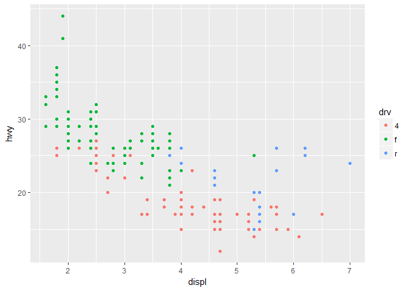
